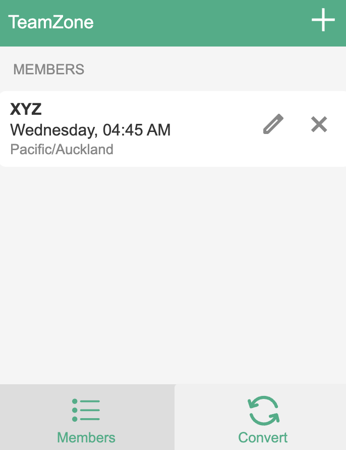

<p align="center">
<br> <!-- This adds a blank line -->

# TeamZone - Manage Team Timezones Efficiently


TeamZone is a simple Chrome extension designed to help teams working across different time zones manage their schedules more effectively. It offers functionalities to add team members, convert local times to other time zones, and display time for all team members in one place. Whether you're coordinating a meeting or checking if it's a good time to contact a colleague, TeamZone has you covered.

## Features

- **Add Team Members:** Easily add and manage team members, including their names and time zones.
- **Time Conversion:** Convert your local time to the time zones of your team members.
- **User-friendly Interface:** Simple, intuitive interface with quick access to time zones.
- **Real-time Updates:** See the current time for each team member and convert times with a click.

<br> <!-- This adds a blank line -->

<p align="center">
<p align="center">
    <strong>Working Screenshot of Extension</strong>
</p>
<br> <!-- This adds a blank line -->

## Installation

1. Download the extension from the Chrome Web Store.
2. Click the TeamZone icon in the toolbar to open the popup window.
3. Start adding your team members by clicking the "Add Member" button.

## How to Use

1. **Add Members**: Add a new member by entering their name and selecting their time zone.
2. **View Members**: The main screen lists all added members with their current local time.
3. **Convert Time**: Use the "Convert Time" tab to select a date and time to convert between time zones.

## Development

To set up a local development environment:

1. Clone the repository.
2. Run the following commands to install dependencies and serve the project:
   
    ```bash
    npm install
    npm run dev
    ```
4. Load the extension in Chrome via `chrome://extensions` in Developer Mode.

## Files
```bash
TeamZone/
├── popup.css
├── popup.html
├── popup.js
├── manifest.json
└── icon.png (16,32,48,128)
```

## License

This project is licensed under the GNU GENERAL PUBLIC LICENSE v2.0. See the [LICENSE](LICENSE) file for more details.

## Contact

If you have any questions or feedback, you can reach me through the following methods:

  <a href="https://www.linkedin.com/in/yajkotak" target="_blank">
    
  </a>


